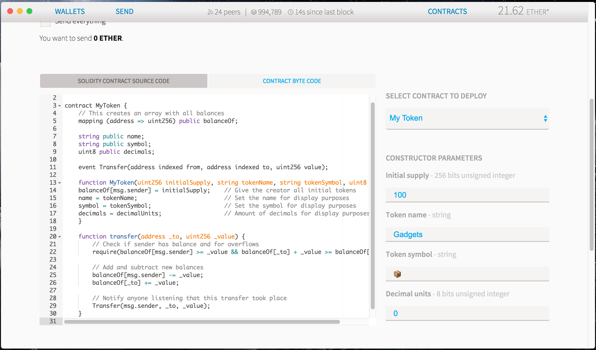
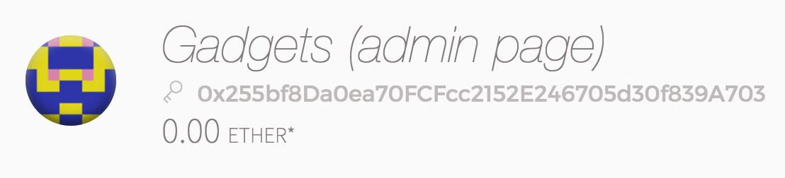

Crowdsale
==========
Sometimes a good idea takes a lot of funds and collective effort.
You could ask for donations, but donors prefer to give to projects they are more certain will get traction and proper funding.
This is an example where a crowdfunding would be ideal: you set up a goal and a deadline for reaching it. If you miss your goal, the donations are returned, therefore reducing the risk for donors.
Since the code is open and auditable, there is no need for a centralized, trusted platform and therefore the only fees everyone will pay are just the gas fees.

## Features
- [x] create a token as reward
- [x] create a shareholder association
- [x] create crowdsale contract

## Screenshots

##### Token

##### Shareholder Association

##### Crowdsale

##### Deposit Gadgets to our Crowdsale contract

##### Donate transaction & Donate log

---

Source: 

- [CROWDSALE: RAISING FUNDS FROM FRIENDS WITHOUT A THIRD PARTY](https://ethereum.org/crowdsale)
